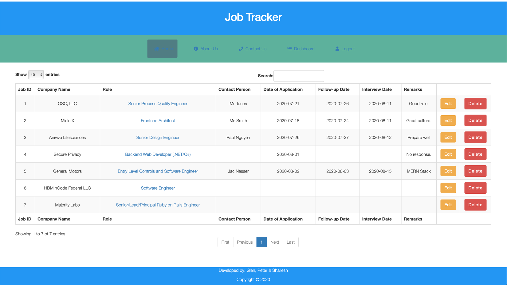

## Table of contents

-   [General info](#general-info)
-   [JobTracker Link](#JobTracker-link)
-   [MVP Deliverables](#necessary-MVP)
-   [To Do or Future Items](#Future-Items)
-   [Screenshots](#screenshots)
-   [In-depth Features of Job Tracker](#in-depth-features-of-Job-Tracker)
-   [Challenges](#challenges)
-   [Technologies Used](#technologies-used)
-   [Approach Taken](#approach-taken)
-   [Download](#download)

## General info

This application to demonstrate both client side and Server side technologies to encapsulate the following key ideas:

-   an application to source a RESTFUL api and store job adverts in a database.
-   Jobs will focus on IT/Software Devloper roles.
-   a user to register/login and view jobs.
-   a user to save jobs that they will apply for
-   a user to see all saved jobs, track what they have applied for.

## JobTracker Link

-   The link to the Job Tracker online application is here:
    [https://young-oasis-03810.herokuapp.com]
-   Public access to ER Diagram / Schema, Kanban, User Stories and Wireframe link:
    [https://whimsical.com/7xHydLZc8NTdFPgRLJB16R]
-   Scoping Document decscribing the MVP and requirements before any coding taking place
    [https://drive.google.com/file/d/1JsB3I8G-WqzHJ68LK4I3m4V-_d-rv50U/view?usp=sharing]

## Necessary MVP

Utilising Node, Express, JS, Bcrypt, Axios, Postgres, the application's MVP are the following deliverables:

-   A user can register their details and login to the application securely with their password being hashed in the database.
-   A user can refresh a list of all available jobs via the 'github jobs' API.
-   A user can view and save any particular job they like to a seperate list.
-   If a user likes a role, they can submit and store key information (e.g. Application Date, Interview Date, Contact person etc) to track the progress.
-   A user can delete a saved job where no longer applicable.

## Future-Items

The following possible features could be included in other iterations:

-   incorporate other API feeds into the database (i.e. Indeed.com API)

## Screenshots

## In-depth Features of Job Tracker

-   Hasing of passwords when stored in the Postgres database.
-   AXIOS is utilised for a RESTFUL API.
-   Bootstrap was used to assist in visual design and consistency.
-   EJS Templates were utilised ensuring consistency for each web page.
-   A number of CDNs were utilised in the app. (Jquery, Bootstrap, Skeleton etc).
-   Data error checking occurs on the Interview Date field.

## Challenges

-   Ensuring Axios continues to obtain all jobs (Github pages API only allows 50 results per page) to be returned. If there was 347 jobs, the solution would need to cater for muliple pages.
-   Hashing of passwords via Bcrypt and stored in a database.

## Approach Taken

Given this was a group delivered, we treated it like an Agile project:

-   Developed an initial Scope document that included an overall scope, a product feature breakdown and indicative database design.
-   Twice daily stand-up sessions occured to agree on features to be developed next along with supporting each other.
-   Frequent commits and rebasing of the code occured to ensure all project members had the latest build.

## Technologies Used

Project is created with:

API:

1. Github Jobs API

Backend: Node.js
NPM Packages:

1. Express
2. pg
3. pg-escape
4. body-parser
5. npm
6. ejs
7. axios
8. nodemon

Database:

1. PostgreSQL

Frontend:

1. HTML
2. CSS
3. JavaScript

Deployment:

1. Heroku

3rd Party:

1. Bootstrap
2. Skeleton
3. jQuery
4. Font Awesome
5. Axios

Version Control:

1. Git

## Download

Download via:

-   https://github.com/mistergjones/jobtracker.git
